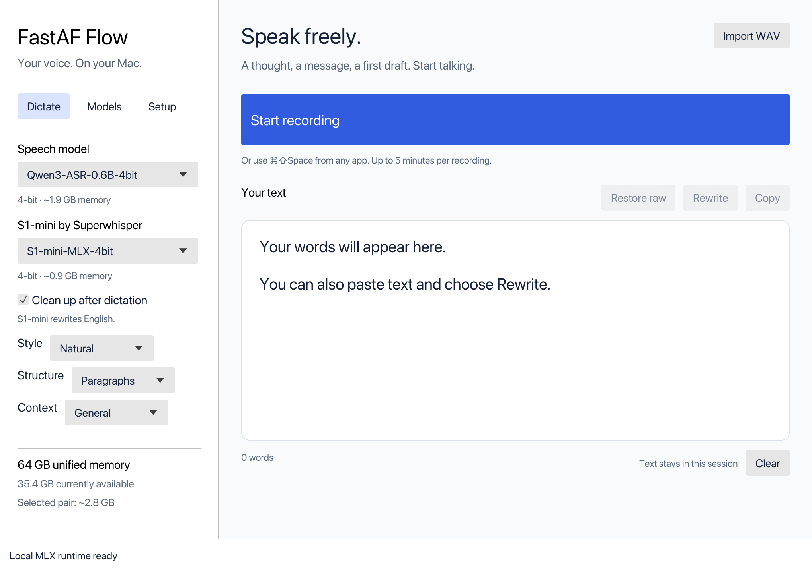
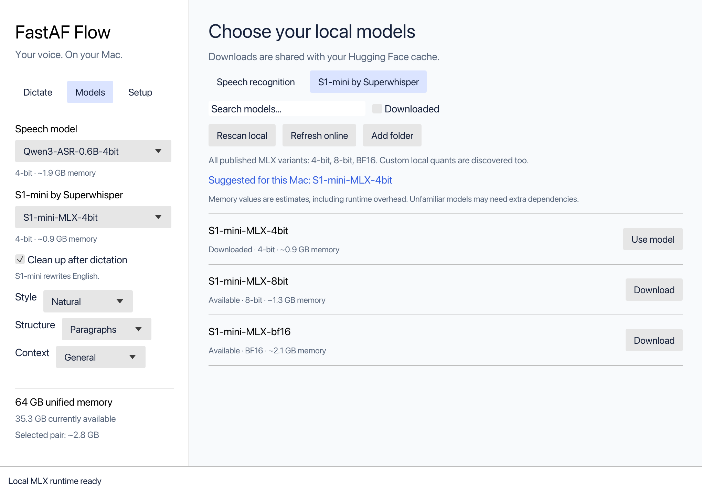

# FastAF Flow

Local dictation for Apple Silicon. A small Rust desktop app that turns speech into clean text with **MLX Audio** and **S1-mini by Superwhisper**, running through **MLX-LM**.

[Download v1.0.0](https://github.com/ksg98/fastaf-flow/releases/tag/v1.0.0) · [Model guide](docs/MODELS.md) · [Contributing](CONTRIBUTING.md)



## Install

Requires an **Apple Silicon Mac (M1 or later), macOS 14+, and at least 8 GB of memory**. The release has been tested on an M3 Max running macOS 26.6.2. It does not run MLX on Intel Macs, Windows, or Linux.

1. Download the ZIP or DMG from [Releases](https://github.com/ksg98/fastaf-flow/releases).
2. Move **FastAF Flow.app** to Applications and open it.
3. In **Setup**, click **Install runtime**. The bundled uv installer downloads Python 3.12 and the locked MLX dependencies into the app's own environment. No terminal setup is required.
4. In **Models**, choose a downloaded speech model and **S1-mini by Superwhisper**, or download them. Qwen3-ASR 0.6B 4-bit + S1-mini 4-bit is a small starting pair.
5. Click **Start recording**, allow Microphone access, and talk. Click again to finish.

**This initial release is ad-hoc signed, not Apple notarized.** If macOS blocks it, follow Apple's **System Settings → Privacy & Security → Open Anyway** flow after attempting to open the downloaded app. No Apple developer certificate is bundled.

First setup and model downloads need internet. Transcription and rewriting run offline after that. Allow several GB of disk space for Python, dependencies, and your selected weights; the release ZIP does not include those weights.

## Dictate anywhere

- Press **⌘⇧Space** to start or finish dictation from any app. Hold-to-talk is available in Setup.
- Enable **Insert finished dictation into the active app** and grant Accessibility access to paste the result at the cursor. This replaces the clipboard with your dictation. The target app must still be active when processing finishes; otherwise use **⌘V** yourself.
- The record button and WAV import put the result in the editor. Edit it, copy it, rewrite it, or restore the raw transcript.
- Closing the window keeps the app in the menu bar. Use its menu to reopen the window or quit.
- **Escape** cancels recording, inference, or downloads. Recordings are limited to five minutes.

## Models that are already on your Mac

The dropdowns contain locally downloaded, compatible speech models and S1-mini variants. FastAF Flow scans the Hugging Face cache, `~/.lmstudio/models`, `~/Models`, and folders you add. It honors `HF_HUB_CACHE`, `HUGGINGFACE_HUB_CACHE`, `HF_HOME`, and `XDG_CACHE_HOME`.

Metadata-only caches, broken weight links, and incomplete shard sets are excluded. Existing `mlx-whisper` NPZ checkpoints can run through a local compatibility backend without converting or duplicating their weights. Text-to-speech models do not appear in the dictation picker.

The bundled library contains 236 model entries. **Refresh online** discovers current published speech models and all MLX S1-mini variants. The known S1-mini variants in v1 are **4-bit, 8-bit, and BF16**; custom local quantizations are detected from their configs as well. The library is a discovery list, not a claim that every third-party checkpoint has been tested.



Recommendations favor usable downloaded models and account for total and currently available memory. Memory estimates include space for inference, not just weights. When the selected pair exceeds the estimated budget, the worker unloads one model before loading the other. Estimates are advisory: available memory changes and long inputs need more.

## S1-mini rewriting

**S1-mini by Superwhisper** is an English text normalizer, not a general chatbot. It removes fillers, resolves spoken corrections, and formats punctuation and numbers. The app uses the publisher's exact system prompt and control line, greedy generation, and `enable_thinking=False` with MLX-LM.

| Control | Choices |
| --- | --- |
| Style | Casual, Relaxed (`semi-casual`), Natural (`semi-formal`), Formal |
| Structure | Paragraphs, Lists |
| Context | General, Email |

Long text is split into bounded chunks. A filler-only input may correctly produce an empty result. Raw text remains available if rewriting fails. Choosing a specific non-English speech language skips automatic S1-mini cleanup; a detected non-English result also skips cleanup. When an ASR model does not return a language, turn cleanup off yourself for non-English dictation.

## Privacy

The Rust app captures the default microphone into RAM. After recording, it creates a private temporary WAV, sends its path to the local worker over standard input, and deletes it after processing, cancellation, or a normal exit. An OS crash or force-kill may leave a temporary file until the system cleans it up.

Inference workers set Hugging Face and Transformers offline mode and load local paths. Online discovery/download workers are separate and reject inference requests. No inference server, API key, telemetry, account, or transcript history is used. Settings and the model catalog are stored in `~/Library/Application Support/dev.fastaf.FastAF-Flow/`; use `FASTAF_DATA_DIR` to override this location. Diagnostics are held briefly in RAM rather than written to log files. Clipboard managers and destination apps have their own storage behavior.

## Build from source

Install [Rust](https://rustup.rs), Xcode Command Line Tools, and [uv](https://docs.astral.sh/uv/getting-started/installation/), then:

```sh
git clone https://github.com/ksg98/fastaf-flow.git
cd fastaf-flow
uv sync --project worker --frozen --python 3.12
cargo run --locked
```

Rust owns the native egui interface, CoreAudio capture through CPAL, settings, model discovery, memory recommendations, global shortcut, menu bar, clipboard insertion, and worker lifecycle. A small persistent Python worker hosts the upstream MLX model implementations. **This is a Rust desktop app with a Python MLX worker, not a pure-Rust port of MLX Audio.** No Electron, webview, Node, or web server is required.

```sh
cargo fmt --check
cargo clippy --locked --all-targets -- -D warnings
cargo test --locked
python3 -m unittest discover -s tests -v
scripts/bundle.sh
```

The build script makes an ad-hoc-signed `.app` and ZIP in `dist/`, bundles uv and third-party notices, and excludes local Python environments and weights. Both `Cargo.lock` and `worker/uv.lock` are committed. Set `FASTAF_PYTHON` to use an existing compatible Python executable, or `FASTAF_UV_BIN` to select the installer used when packaging.

The packaged binary also accepts `--doctor`, `--setup-runtime`, `--list-models`, and `--transcribe /path/to/audio.wav`. The last command prints JSON with raw and cleaned text and uses your chosen models/settings without changing the clipboard.

For a real GPU smoke test, download `mlx-community/Qwen3-ASR-0.6B-4bit` and S1-mini 4-bit, then run `scripts/smoke-test.sh`. It creates synthetic speech using macOS's `say`, tests the complete Rust IPC pipeline, and checks cancellation and recovery. It never records the microphone. See [v1 validation](docs/VALIDATION.md) for scope and limitations.

## License & credits

FastAF Flow's own code is [MIT licensed](LICENSE). Model weights are downloaded from their publishers and retain their own licenses. **S1-mini by Superwhisper** uses Apache 2.0 with an additional naming clause; the [license](docs/licenses/S1-mini-LICENSE) and [notice](docs/licenses/S1-mini-NOTICE) are preserved here. We use its published prompt unchanged and do not redistribute its weights.

Built with [egui](https://github.com/emilk/egui), [MLX Audio](https://github.com/Blaizzy/mlx-audio), [MLX-LM](https://github.com/ml-explore/mlx-lm), [MLX Whisper](https://github.com/ml-explore/mlx-examples/tree/main/whisper), [CPAL](https://github.com/RustAudio/cpal), and [uv](https://github.com/astral-sh/uv). FastAF Flow is an independent project and is not affiliated with Wispr Flow or Superwhisper.
